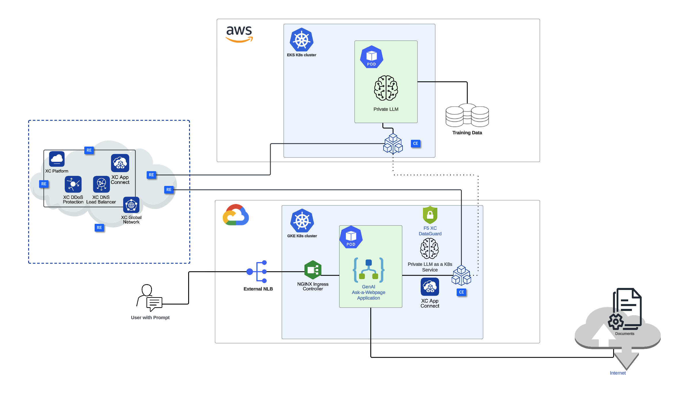

Connecting and securing distributed Generative AI applications with F5 XC AppConnect and XC WAF (hosted in AWS and Google Cloud)
================================================================================================================================

Overview
#########

This demo guide provides step-by-step walkthrough for connecting a distributed GenAI application (LLM hosted in AWS EKS and front-end GenAI application hosted in GCP's GKE) with F5's XC AppConnect and securing it with XC WAF, using XC console along with terraform scripts to automate the deployment. For more information on different WAAP deployment modes, refer to the devcentral article: `
Deploy WAF on any Edge with F5 Distributed Cloud <https://community.f5.com/t5/technical-articles/deploy-waf-anywhere-with-f5-distributed-cloud/ta-p/313079>`__.

Setup Diagram
#############

Workflow Instructions
######################

`F5 Distributed Cloud Console Workflow <./xc-console-demo-guide.rst>`__

**Coming soon** `F5 Distributed Cloud Automation Workflow`

Additional Related Resources
############################
