Getting started with automation of connecting and securing distributed Generative AI applications with F5 XC AppConnect and XC WAF
#########################################################################################################################################

Prerequisites
--------------

-  `F5 Distributed Cloud (F5 XC) Account <https://console.ves.volterra.io/signup/usage_plan>`__
-  `AWS Account <https://aws.amazon.com/>`__ 
   - Since, paid resources are getting created, free tier will not work.
   - Please make sure resources like VPC and Elastic IPs are below the threshold limit in that aws region.
-  `GCP Account <https://cloud.google.com/>`__ 
   - Please follow `devcentral article <https://community.f5.com/kb/technicalarticles/creating-a-credential-in-f5-distributed-cloud-for-gcp/298290>`__ to create a GCP Service account
   - Make sure to assign Editor, Kubernetes Engine Admin, Kubernetes Engine Cluster Admin roles. (Navigate to IAM & Admin > IAM to assign these roles to the created service account)

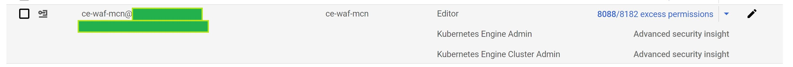
-  `Terraform Cloud Account <https://app.terraform.io/session>`__
   - Create CE site tokens in XC console

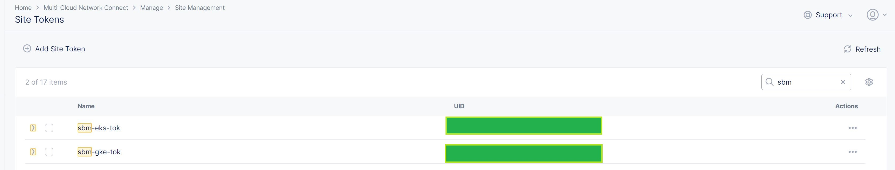
-  `GitHub Account <https://github.com>`__

List of Existing Assets
------------------------

-  **xc:** F5 Distributed Cloud WAF
-  **aws/gcp-infra:** AWS/GCP Infrastructure
-  **eks:** Elastic Kubernetes Service
-  **gke:** Google Kubernetes Engine
-  **app:** Distributed streamlit app
-  **nic:** Nginx Ingress Controller

Tools
------

-  **Cloud Providers:** AWS, GCP
-  **IAC:** Terraform
-  **IAC State:** Terraform Cloud
-  **CI/CD:** GitHub Actions

Terraform Cloud
----------------

-  **Workspaces:** Create CLI or API workspaces for each asset in the
   workflow.

   +---------------------------------+------------------------------------------------------------------------+
   |         **Workflow**            |  **Assets/Workspaces**                                                 |
   +=================================+========================================================================+
   | hybrid-genai-appconnect-waf     | aws-infra, gcp-infra, eks, gke, llm-wl, app, eks-ce, gke-ce, xc, nic   |
   +---------------------------------+------------------------------------------------------------------------+

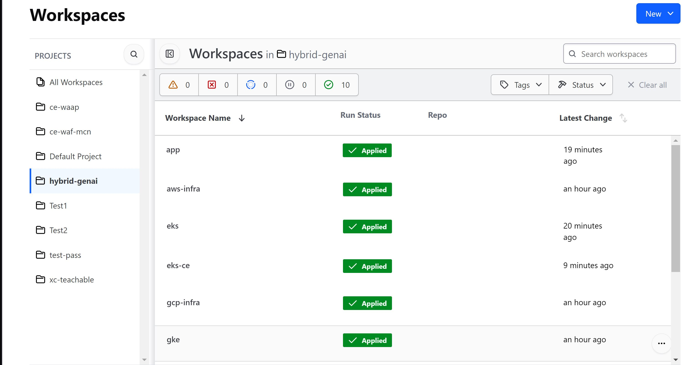

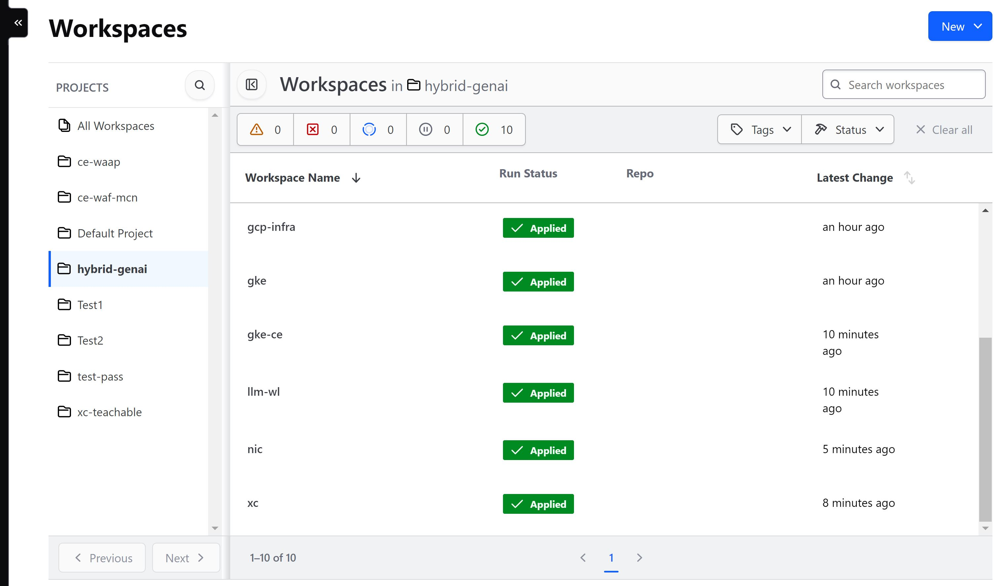

-  **Workspace Sharing:** Under the settings for each Workspace, set the
   **Remote state sharing** to share with each Workspace created.

-  **Variable Set:** Create a Variable Set with the following values:

   +------------------------------------------+--------------+------------------------------------------------------+
   |         **Name**                         |  **Type**    |      **Description**                                 |
   +==========================================+==============+======================================================+
   | AWS_ACCESS_KEY_ID                        | Environment  | Your AWS Access Key ID                               |
   +------------------------------------------+--------------+------------------------------------------------------+
   | AWS_SECRET_ACCESS_KEY                    | Environment  | Your AWS Secret Access Key                           |
   +------------------------------------------+--------------+------------------------------------------------------+
   | AWS_SESSION_TOKEN                        | Environment  | Your AWS Session Token                               | 
   +------------------------------------------+--------------+------------------------------------------------------+
   | GOOGLE_CREDENTIALS                       | Environment  | Your Google Service account credential               |
   +------------------------------------------+--------------+------------------------------------------------------+
   | VES_P12_PASSWORD                         | Environment  | Password set while creating F5XC API certificate     |
   +------------------------------------------+--------------+------------------------------------------------------+
   | VOLT_API_P12_FILE                        | Environment  | Your F5XC API certificate. Set this to **api.p12**   |
   +------------------------------------------+--------------+------------------------------------------------------+
   | ssh_key                                  | TERRAFORM    | Your ssh key for accessing the created resources     | 
   +------------------------------------------+--------------+------------------------------------------------------+
   | tf_cloud_organization                    | TERRAFORM    | Your Terraform Cloud Organization name               |
   +------------------------------------------+--------------+------------------------------------------------------+

-  Variable set created in terraform cloud:

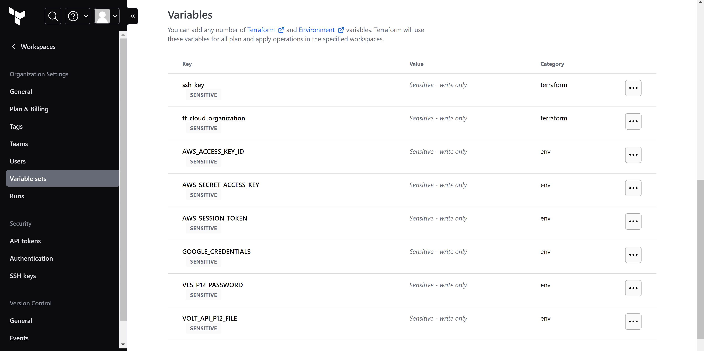

GitHub
-------

-  Fork and Clone Repo. Navigate to ``Actions`` tab and enable it.

-  **Actions Secrets:** Create the following GitHub Actions secrets in
   your forked repo

   -  P12: The linux base64 encoded F5XC P12 certificate
   -  TF_API_TOKEN: Your Terraform Cloud API token
   -  TF_CLOUD_ORGANIZATION: Your Terraform Cloud Organization name
   -  TF_CE_LATITUDE: Your CE latitude location 
   -  TF_CE_LONGITUDE: Your CE longitude location 
   -  TF_EKS_CE_TOKEN: CE token ID generated in Distributed Cloud
   -  TF_GKE_CE_TOKEN: CE token ID generated in Distributed Cloud
   -  TF_VAR_EKS_SITE_NAME: CE site name to be registered
   -  TF_VAR_GKE_SITE_NAME: CE site name to be registered
   -  TF_CLOUD_WORKSPACE\_\ *<Workspace Name>*: Create for each
      workspace in your workflow per each job

      -  EX: TF_CLOUD_WORKSPACE_AWS_INFRA would be created with the
         value ``aws-infra``

      -  EX: TF_CLOUD_WORKSPACE_GKE_CE would be created with the
         value ``gke-ce``

      -  EX: TF_CLOUD_WORKSPACE_LLM_WL would be created with the
         value ``llm-wl``

-  Created GitHub Action Secrets:

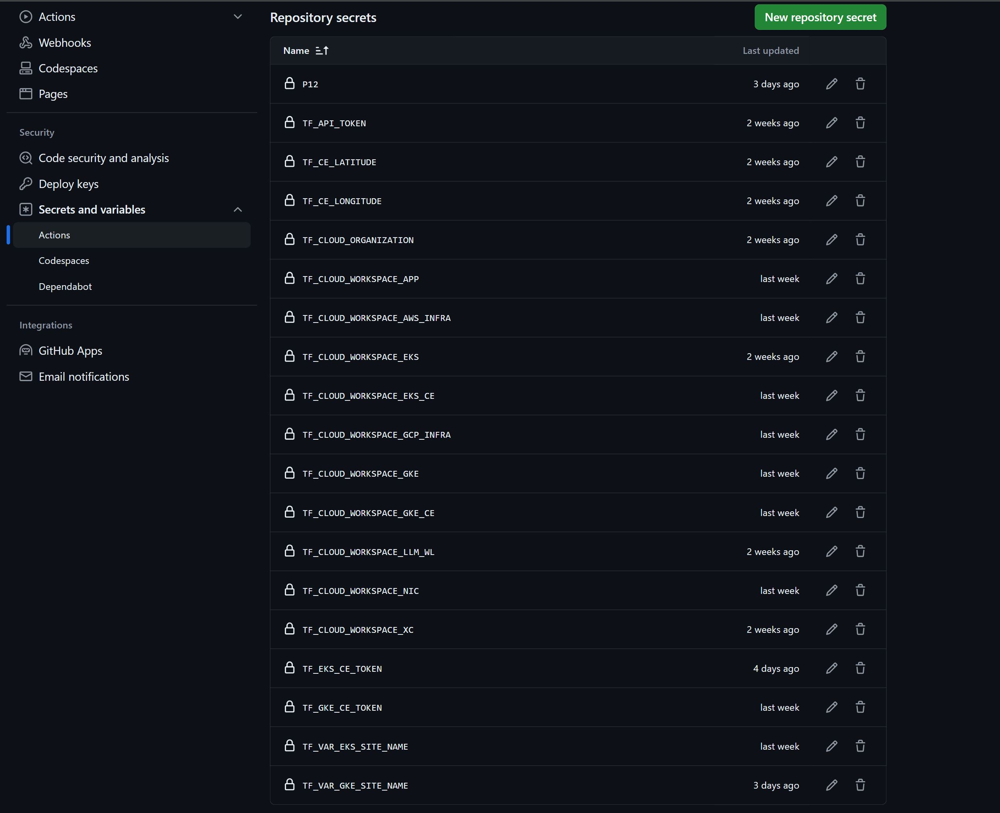

Workflow Runs
--------------

**DEPLOY**

============================= =======================
Workflow                      Branch Name
============================= =======================
hybrid-genai-appconnect-waf   deploy-hybrid-genai
============================= =======================

Workflow File: `hybrid-genai-apply.yml </.github/workflows/hybrid-genai-apply.yml>`__

**DESTROY**

=============================== ========================
Workflow                        Branch Name
=============================== ========================
hybrid-genai-appconnect-waf     destroy-hybrid-genai
=============================== ========================

Workflow File: `hybrid-genai-destroy.yml </.github/workflows/hybrid-genai-destroy.yml>`__

**STEP 1:** Check out a branch with the branch name as ``deploy-hybrid-genai``

**STEP 2:** Rename ``aws/aws-infra/terraform.tfvars.examples`` to ``aws/aws-infra/terraform.tfvars`` and add the following data: 

-  Set project_prefix = “Your project identifier name in **lower case** letters only - this will be applied as a prefix to all assets”

-  Set resource_owner = "Set reource owner name"

-  Set aws_region = "AWS Region" ex. "ap-south-1"

-  Set azs = "Set availability zones" ex. ["ap-south-1a", "ap-south-1b"]

-  Also update assets boolean value as per your workflow (for this use-case set all remaining values as false)

**STEP 3:** Rename ``gcp/gcp-infra/terraform.tfvars.examples`` to ``gcp/gcp-infra/terraform.tfvars`` and add the following data:

-  Set project_prefix = “Your project identifier name in **lower case** letters only - this will be applied as a prefix to all assets”

-  Set project_id = "Your project's unique identifier"

-  Set region = "GCP Region" ex. "us-central1"

**STEP 4:** Rename ``aws/eks-cluster/terraform.tfvars.examples`` to ``aws/eks-cluster/terraform.tfvars`` and add the following data:

-  Set skip_ha_az_node_group = true
-  Set desired_size = 3
-  Set max_size = 3
-  Set min_size= 3
-  Set skip_private_subnet_creation = true
-  Set allow_all_ingress_traffic_to_cluster = true
-  Set aws_genai = "aws-infra" 

**Step 5:** Rename ``xc/terraform.tfvars.examples`` to ``xc/terraform.tfvars`` and add the following data: 

-  api_url = “Your F5XC tenant” 

-  xc_tenant = “Your tenant id available in F5 XC ``Administration`` section ``Tenant Overview`` menu” 

-  xc_namespace = “The existing XC namespace where you want to deploy resources” 

-  app_domain = “the FQDN of your app (for this use case set it to "llama.llm")” 

-  xc_waf_blocking = “Set to true to configure waf in blocking mode”

-  k8s_pool = "set to true if application is residing in k8s environment"

-  serviceName = "k8s service name" (for this use case set it to "llama.llm")

-  serviceport = "k8s service port of frontend microservice" (for this use case set it to "8000")

-  advertise_sites = "set to false if want to advertise on public (for this use case set it to true)"

-  http_only = "set to true if want to deploy a http loadbalancer, for https lb set it to false (for this use case set it to true)"

-  xc_data_guard = "Data guard feature for masking sensitive fields (for this use case set it to true)"

-  aws  = "workspace name of AWS Infra (for this use-case set it to aws-infra)"

-  hybrid_genai = "Set it to true for this use-case"

Keep rest of the values as they are set by default in terraform.tfvars.examples file.

**STEP 6:** Commit and push your build branch to your forked repo. 

- Build will run and can be monitored in the GitHub Actions tab and TF Cloud console

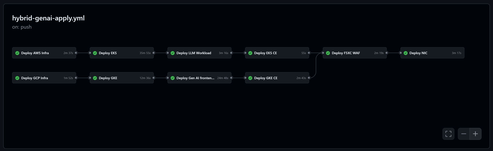

**STEP 7:** Once the pipeline completes, verify your CE sites, Origin Pool and LB in XC console, to conclude if they were deployed or destroyed successfully based on your workflow. (**Note:** CE sites will take some time [10-15 mins.] to come online)

(**Note:** if job `Deploy LLM Workload` fails, rerun the pipeline [Push some test commit to deploy branch])

**STEP 8:** To validate the test infra, copy the public IP of LB (**Note:** In terraform cloud click on `nic` workspace and select `Outputs` tab to get the public IP), Map the public IP to a domain (host: "*.com").

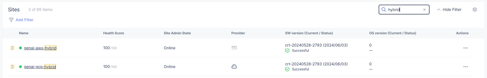

Just like in manual steps, Open the browser and enter the mapped domain in URL section to access the genai application. In the 'Web page to load' field, input 'https://dlptest.com/sample-data/namessndob/'. For 'Search Query', put 'What is Robert Aragon's SSN?'. Click on 'Search' button and make sure SSN data is masked as XC data guard is enabled.

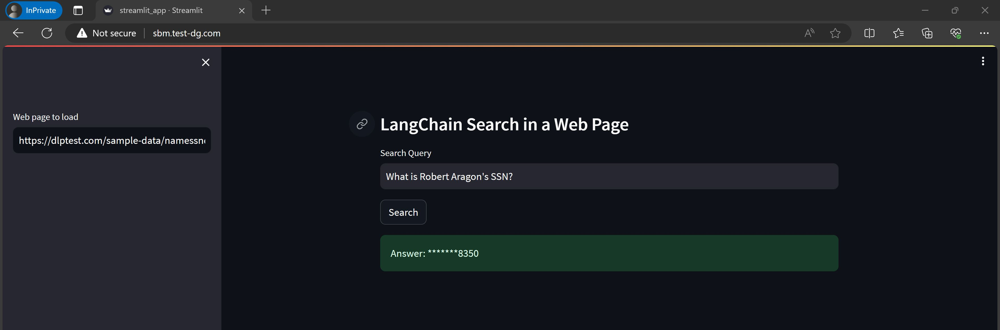

XC Logs:

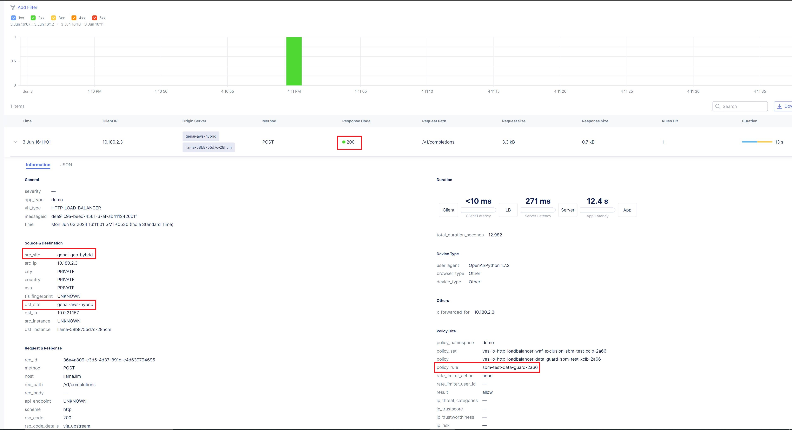

**Step 9:** If you want to destroy the entire setup, checkout a branch with name ``destroy-hybrid-genai`` and push the repo code to it, this will trigger destroy workflow and will remove all created resources (**Note:** destroy jobs related to destruction of deployments to gke cluster may sometimes fail because of auth issues but the pipeline eventually will get pass as deletion of cluster will destroy all deployments)

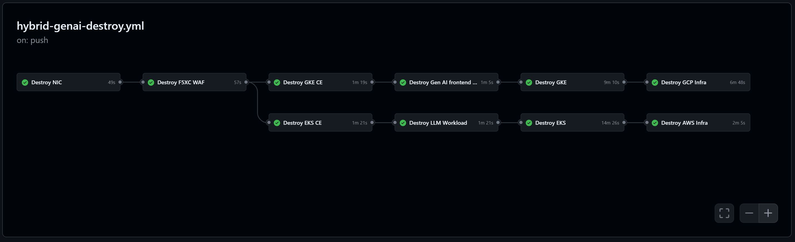

